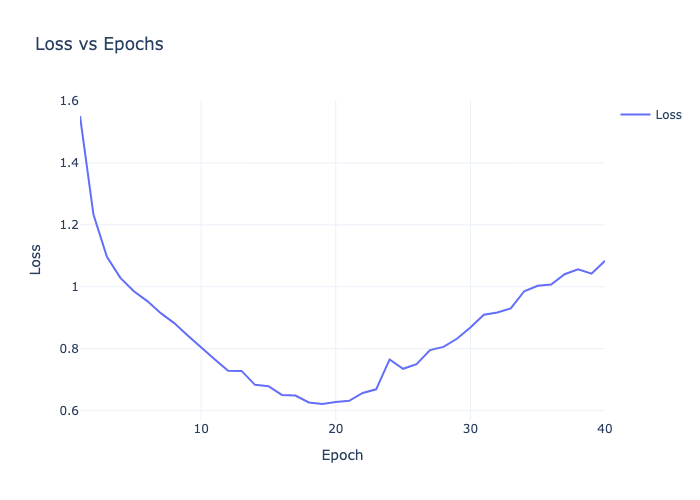
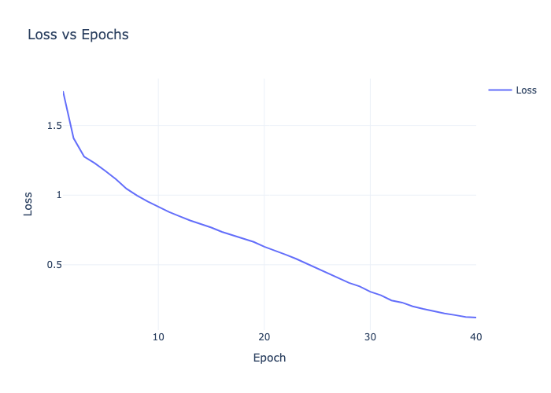
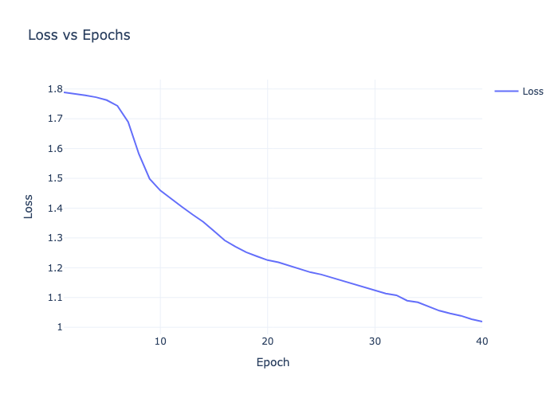
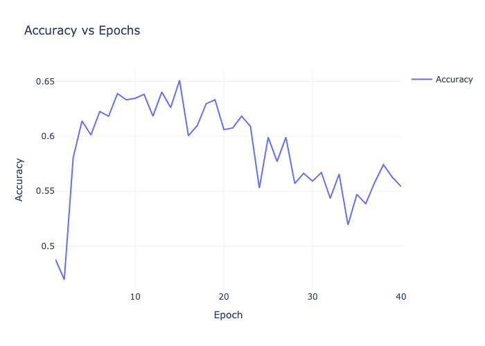
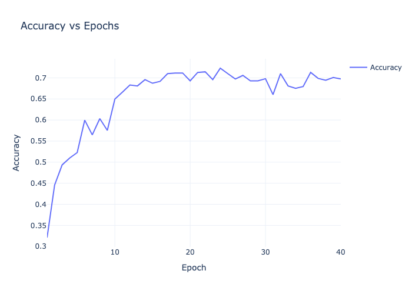
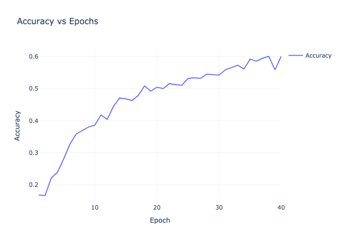
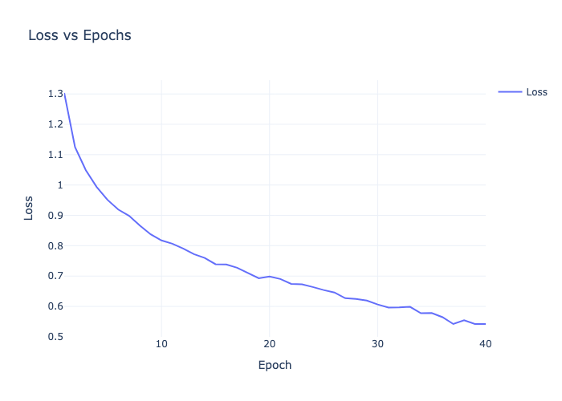
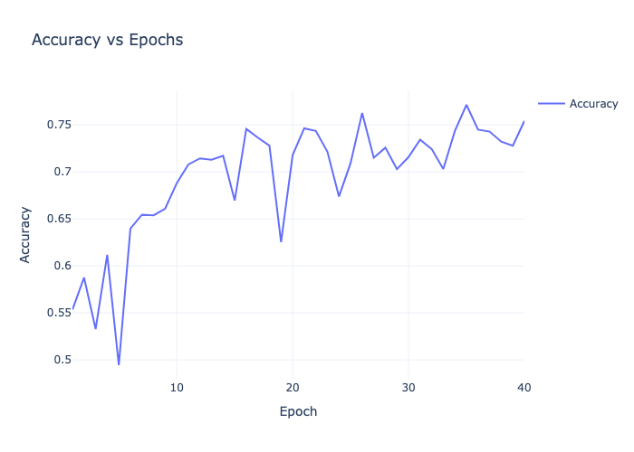

---
author:
- |
  Elie BRUNO\
  Maira GAUGES
title: Deep Learning
---

Instituto Superior Técnico\
IST-2024 - Deep Learning

**Report - Deep Learning - HW2**

  --------------
  *Students:*\
  BRUNO Elie\
  GAUGES Maira
  --------------

*Professor:*\
FIGUEIREDO Mario

2025-03-15

# Question I

# Question 2: Image Classification with CNNs

## 2.1 Basic CNN Implementation

We implemented a convolutional neural network for the Intel Image
Classification dataset with three convolutional blocks followed by an
MLP classifier.
The initial architecture consisted of:

-   Three convolutional blocks with output channels (32, 64, 128)

-   Each block containing:

    -   3x3 convolution with stride 1 and padding 1

    -   ReLU activation

    -   2x2 max pooling with stride 2

    -   Dropout (p = 0.1)

-   MLP block with:

    -   Flattened convolutional output

    -   Dense layer (1024 units)

    -   ReLU activation

    -   Dropout (p = 0.1)

    -   Dense layer (512 units)

    -   ReLU activation

    -   Output layer (6 units) with LogSoftmax

After testing different learning rates (0.1, 0.01, 0.001), we found that
lr = 0.01 provided the best performance. This configuration achieved a
test accuracy of 70.33% with 5,340,742 trainable parameters. The model
demonstrated stable learning behavior, though there was room for
improvement in terms of both accuracy and efficiency.

## 2.2 Enhanced CNN with Batch Normalization

We then modified the architecture to include batch normalization and global average pooling.

-   Added batch normalization after each convolution layer

-   Replaced flattening with global average pooling (1x1 kernel)

-   Added batch normalization in the MLP block before dropout

-   Increased test accuracy to 75.23% (+4.9% absolute improvement)

-   Reduced model parameters to 756,742 (85.8% reduction)

-   Better training stability with:

    -   Training loss: 0.5421

    -   Validation loss: 0.6795

    -   Validation accuracy: 75.43%

## Analysis of Improvements

### 1. Batch Normalization Effects

The addition of batch normalization layers provided several benefits:

-   Reduced internal covariate shift

-   Enabled faster training with more stable gradients

-   Acted as a regularizer, improving generalization

-   Allowed for better gradient flow through the network

### 2. Global Average Pooling

Replacing the flattening operation with global average pooling:

-   Drastically reduced the number of parameters (from 5.3M to 756K)

-   Enforced stronger spatial feature learning

-   Improved generalization by reducing overfitting

-   Made the model more robust to spatial translations

## Analysis of Parameter Count Differences

We implemented the `get_number_trainable_params` function to analyze the
number of trainable parameters in both networks. The significant
difference in parameter count (5,340,742 vs 756,742) can be attributed
to several key factors:

1.  **Flattening vs Global Average Pooling**: The most substantial
    reduction comes from replacing the flattening operation with global
    average pooling:

    -   In the original network, flattening created a large feature
        vector (128 \* width \* height) that connected to the first
        dense layer (1024 units)

    -   Global average pooling reduces each feature map to a single
        value, resulting in just 128 features connecting to the dense
        layer

    -   This change alone eliminated millions of parameters in the first
        dense layer connections

2.  **Preserved Information Flow**: Despite the massive reduction in
    parameters, the network maintains (and even improves) its
    performance because:

    -   Global average pooling maintains the spatial relationship of
        features

    -   Batch normalization helps in better gradient flow and feature
        normalization

    -   The reduced parameter count acts as a form of regularization,
        preventing overfitting

The improved performance with fewer parameters demonstrates that the
original architecture was overparameterized, and the modifications
helped create a more efficient and effective model.

## Kernel Size and Pooling Effects

The choice of small kernels (3x3) instead of larger kernels (width ×
height) and the use of pooling layers are fundamental design decisions
in modern CNNs:

### Small Kernel Benefits

-   **Parameter Efficiency**: Small kernels require significantly fewer
    parameters. A 3x3 kernel needs only 9 parameters per channel, while
    a full width×height kernel would need width×height parameters.

-   **Hierarchical Feature Learning**: Stacking multiple layers with
    small kernels allows the network to:

    -   Build increasingly complex features layer by layer

    -   Capture the same receptive field as larger kernels with fewer
        parameters

    -   Learn more discriminative features through multiple non-linear
        transformations

-   **Better Generalization**: Small kernels force the network to learn
    local patterns first before combining them into more complex
    features, leading to better generalization.

### Pooling Layer Effects

The pooling layers (2x2 max pooling in our implementation) serve several
crucial purposes:

-   **Dimensionality Reduction**: Each pooling layer reduces spatial
    dimensions by half, making computation more efficient.

-   **Translation Invariance**: Max pooling helps the network become
    more robust to small translations in the input, as it preserves the
    strongest feature activations in each region.

-   **Hierarchical Processing**: Combined with the convolution layers,
    pooling helps create a hierarchy where:

    -   Early layers detect fine details (edges, textures)

    -   Middle layers combine these into parts

    -   Later layers recognize higher-level concepts

-   **Increased Receptive Field**: Each neuron in deeper layers can
    \"see\" a larger portion of the input image, allowing the network to
    capture more context while maintaining parameter efficiency.

This combination of small kernels and pooling layers creates a powerful
architecture that can efficiently learn hierarchical representations
while maintaining computational feasibility and good generalization
properties.

## Future Considerations

Potential areas for further improvement could include:

-   Experimenting with different learning rate schedules

-   Investigating other normalization techniques (e.g., Layer
    Normalization)

-   Testing different dropout rates

## Conclusion

The enhanced CNN architecture demonstrated substantial improvements over
the baseline model in multiple aspects.

1\. **Efficiency**: The 85.8% reduction in parameters while improving
accuracy suggests a more efficient use of model capacity.

2\. **Performance**: The 4.9% absolute improvement in test accuracy
indicates better generalization.

3\. **Training Stability**: The combination of batch normalization and
global average pooling led to more stable training dynamics.

These results highlight the importance of modern architectural choices
in CNN design, particularly the synergistic effects of batch
normalization and global average pooling. The improvements came not from
adding complexity, but from making the architecture more efficient and
trainable.

# Question III

# Project Workflow

## Task Division

When working on this project we split up the tasks between the two of
us. Results to question 3 were provided by Maira Gauges and while Elie
Bruno worked on question 2. Each wrote the code to obtain the results
and included results in the report.

TODO : First Question.

## Use of Chat GPT / AI Tools

AI tools were used to help with the review of the code and to provide
suggestions for improving the efficiency and readability of the code.
Additionally, they were utilized to assist in the latex report to
properly add the images and graphs.

# Appendix: Graphs and Visualizations

<figure id="fig:training_loss_comparison">
<figure>

<figcaption>LR = 0.1</figcaption>
</figure>
<figure>

<figcaption>LR = 0.01</figcaption>
</figure>
<figure>

<figcaption>LR = 0.001</figcaption>
</figure>
<figcaption>Training Loss for different Learning Rates without Batch
Normalization</figcaption>
</figure>

<figure id="fig:validation_acc_comparison">
<figure>

<figcaption>LR = 0.1</figcaption>
</figure>
<figure>

<figcaption>LR = 0.01</figcaption>
</figure>
<figure>

<figcaption>LR = 0.001</figcaption>
</figure>
<figcaption>Validation Accuracy for different Learning Rates without
Batch Normalization</figcaption>
</figure>

<figure id="fig:metrics_with_batchnorm">
<figure>

<figcaption>Training Loss</figcaption>
</figure>
<figure>

<figcaption>Validation Accuracy</figcaption>
</figure>
<figcaption>Training Metrics with Batch Normalization (LR =
0.01)</figcaption>
</figure>
